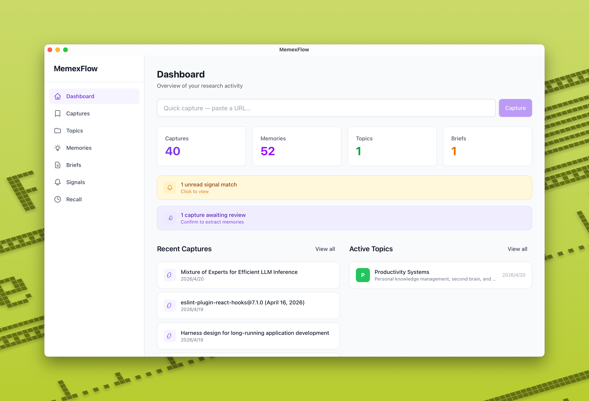
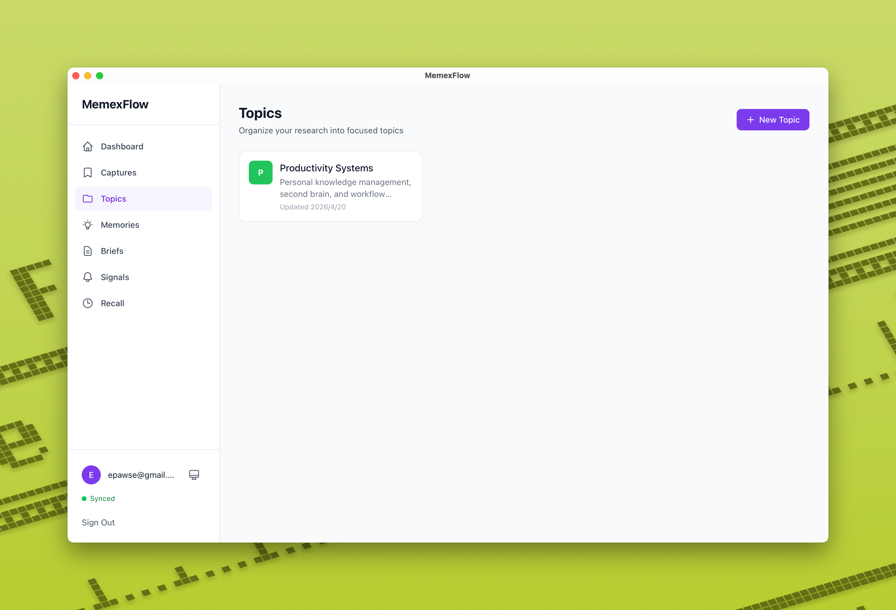
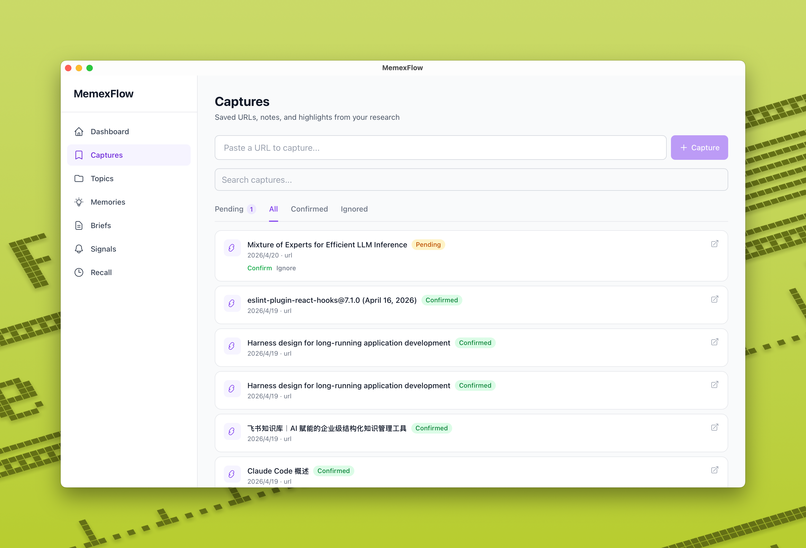
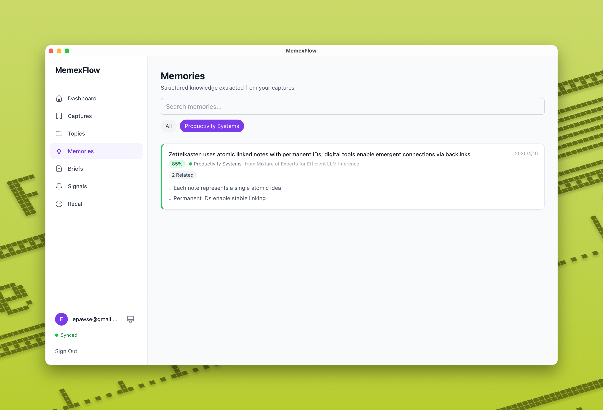

# MemexFlow

**Agent-native personal research OS** — capture URLs, extract structured memories via AI, organize them in topics, and generate research briefs with citations.

Named after Vannevar Bush's 1945 ["Memex"](https://en.wikipedia.org/wiki/Memex) concept — a device for building associative knowledge trails.

## How It Works

```
Capture → Memory → Brief
   ↓        ↓
 Signal    Recall
```

- **Capture** — Paste a URL; AI fetches content and extracts title/summary
- **Memory** — AI extracts structured knowledge units (claims, insights, entities) with confidence scores, embeddings, and source attribution
- **Brief** — AI synthesizes up to 50 memories into a research brief with `[M1]` citation markers
- **Signal** — Proactive monitoring: keyword matches on existing memories + RSS/GitHub external scan
- **Recall** — Spaced-repetition resurfacing (time-based, project-active, association-dense, signal-triggered)

All AI outputs carry source attribution and confidence scores. Memories link to each other with evidence relations (supports / contradicts / elaborates / related).

## Screenshots

<table>
  <tr>
    <td><br><b>Dashboard</b> — Overview with stats, recall suggestions, and priority items</td>
    <td><br><b>Topics</b> — Organize research into topics with color coding</td>
  </tr>
  <tr>
    <td><br><b>Captures</b> — Save URLs and notes, confirm to extract memories</td>
    <td><br><b>Memories</b> — Structured knowledge units with associations</td>
  </tr>
</table>

## Architecture

```
Tauri Desktop App (React/TS)  ↔  Supabase (Postgres + pgvector)  ↔  Python AI Worker
        ↕ PowerSync
     Local SQLite (100% offline reads)
```

| Layer | Tech |
|-------|------|
| Frontend | Tauri 2, React 19, TypeScript, Tailwind CSS v4 |
| Sync | PowerSync (Postgres ↔ SQLite bidirectional) |
| Backend | Supabase (Postgres, pgvector, Auth, Storage, Realtime) |
| AI Worker | Python, Gemini 3 Flash, sentence-transformers/all-MiniLM-L6-v2 |
| Desktop | Tauri 2 (Rust), macOS-first |

### AI Pipeline

| Job | Model | Purpose |
|-----|-------|---------|
| Ingestion | Gemini 3 Flash | Extract title/content/summary from raw HTML |
| Extraction | Gemini 3 Flash | Extract structured memories with confidence scores |
| Embedding | all-MiniLM-L6-v2 (local) | 384-dim vectors for semantic search |
| Briefing | Gemini 3 Flash | Synthesize memories into cited research brief |
| Signal | Gemini 3 Flash (fallback: Gemini 2.5 Flash) | Keyword/regex matching + context extraction |

### Design Influences

- **Hermes Agent** — Three-tier memory model (episodic → semantic → procedural), SQLite FTS5, skill accumulation loop
- **OpenClaw** — Gateway control plane pattern for job queue, event-driven hooks, always-on service architecture

## Getting Started

### Prerequisites

- Node.js 20+
- Rust toolchain (for Tauri)
- Python 3.11+ (for AI worker)
- Supabase account

### Install

```bash
npm install
cd worker && pip install -r requirements.txt
cp .env.example .env  # fill in your keys
```

### Run

```bash
# Frontend (Tauri dev)
npm run tauri dev

# AI Worker
cd worker && python -m src.main
```

### Useful Commands

| Command | Purpose |
|---------|---------|
| `npm run lint` | Lint frontend |
| `npm run type-check` | TypeScript check |
| `npm run test` | Run tests |
| `ruff check worker/` | Lint Python worker |
| `mypy worker/src/` | Type check Python worker |

## Project Structure

```
src/
  features/       # Feature modules (auth, briefs, captures, dashboard, memories, projects, recall, signals)
  shared/         # Shared components, hooks, utils, constants
  hooks/          # PowerSync & data hooks

worker/
  src/
    jobs/         # AI job handlers (ingestion, extraction, briefing, signal, recall)
    models/       # Pydantic schemas
    services/     # Gemini, embedding, content fetching

supabase/
  migrations/    # Database migrations
```

## Status

- ✅ Phase 0: Foundation (scaffold, Supabase, PowerSync, auth)
- ✅ Phase 1: Capture & Memory pipeline
- ✅ Phase 2: Briefs & Signals
- ✅ Phase 3: Recall & Polish

## License

Private — not yet open-sourced.